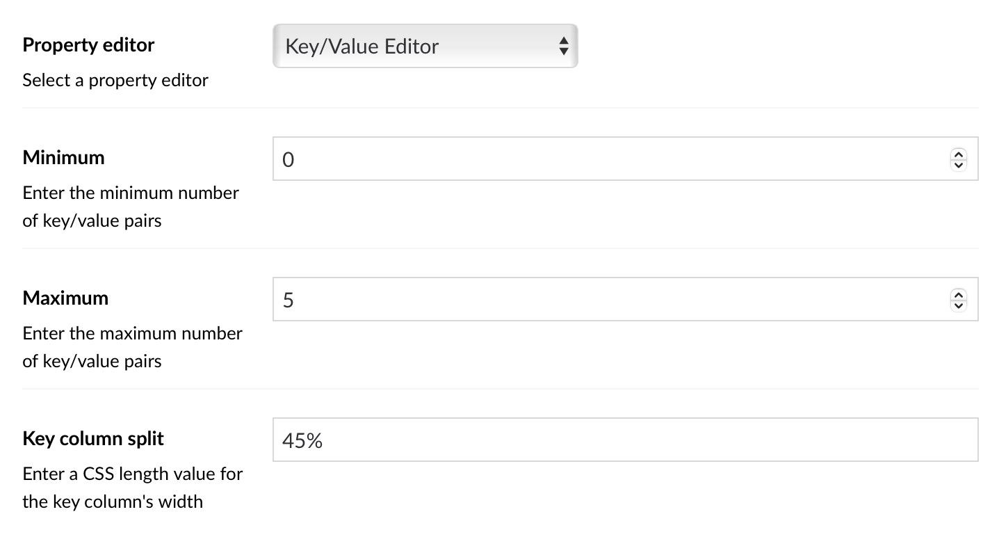

# Key/Value Editor for Umbraco


This property editor is *heavily* based on the **Multiple Textstrings** built-in
property editor, so should look and behave very similar to that one, even though
it has twice as many textboxes. (So hitting <kbd>Enter</kbd>/<kbd>Return</kbd>
adds another set, and you can sort them by using the handles on the right.)

## Versions

- Version 1.x (Umbraco package) works in Umbraco 7 and Umbraco 8
- Version 3.x (Nuget package) works in Umbraco 10 (with .net6) and Umbraco 11 (.net7)

I have not been able to test for Umbraco 9 yet, but there is a [pull request][PR9]
with a version that should work for Umbraco 9 that you can try out, if needed.

Note that you'll need to manually download the appropriate _PropertyValueConverter_
for version 1.1.0, depending on which Umbraco version you have.

The Nuget package installs the PropertyValueConverter automatically.

[PR9]: https://github.com/vokseverk/Vokseverk.KeyValueEditor/pull/4

## Screenshots

### Property editor

**Blank editor**


***

**With content**


### Configuration




## Using the editor

When creating a new DataType, choose `Key/Value Editor` as the property
editor.

As with **Multiple Textstrings** you can specify a minimum number of key/value
sets, as well as a maximum.

## Rendering the output

The raw value is a JSON array with the keys and values, e.g.:

```json
[
  {
    "key": "Species",
    "value": "Tyrannosaurus Rex"
  },
  {
    "key": "Version",
    "value": "4.1"
  }
]
```

You can render it in a couple of different ways:

### 1. Using the Property Value Converter (preferred)

You can render the results like this using Models Builder
(assuming your property was named **Additional settings** with the
alias `additionalSettings`):

```razor
<dl>
  @foreach(var setting in Model.AdditionalSettings) {
    <dt>@(setting.Key)</dt>
    <dd>@(setting.Value)</dd>
  }
</dl>
```

### 2. Without the Property Value Converter

If you can't use the converter, you can use the following way of accessing the
keys and values:

```razor
<dl>
  @foreach(var setting in Model.AdditionalSettings) {
    <dt>@(setting["key"])</dt>
    <dd>@(setting["value"])</dd>
  }
</dl>
```
